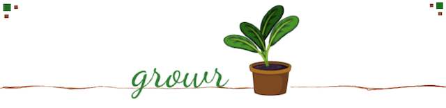
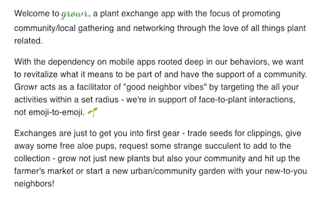
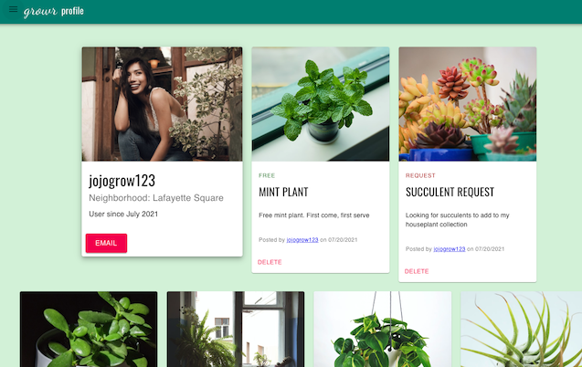
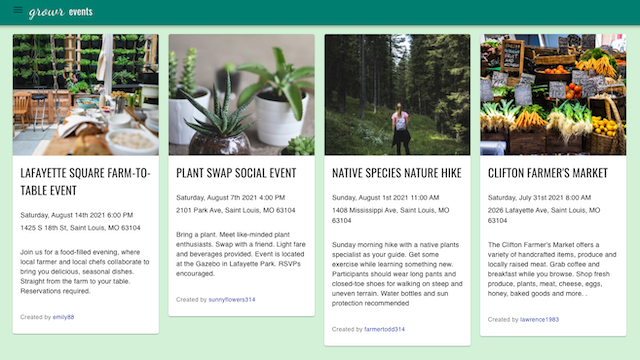
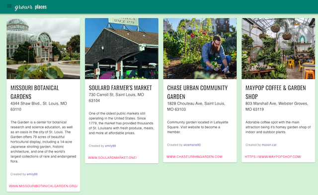

# 
## Table of Contents
1. [Project Overview](#Project-Overview)
2. [Deployement](#Deployement)
3. [MVP](#MVP)
4. [Beyond the MVP](#Beyond-the-MVP)
5. [Installation](#Installation)
6. [Usage](#Usage)
7. [Application Screenshots](#Application-Screenshots)
8. [License](#License)
9. [Credit](#Credit)
****

## Project overview
[](https://opensource.org/licenses/MIT)





### Project Status:

MVP complete --> post MVP: *ONGOING*

#### In progress:
* messenging/inboxing function: currently hardcoded
* authentication: session/connect-mongo vs passport vs JWT


#### Issues to debug:
* responsive-ness
    - almost there but...

### Project Members:
* Brandon Maxwell: [brandon-maxwell](https://github.com/brandon-maxwell)
* Felicia Wootton: [fdwootton](https://github.com/fdwootton)
* Matthew Goad: [matthewxgoad](https://github.com/matthewxgoad)
* Pamela Hsu: [p-hsu](https://github.com/p-hsu)
* Riheel H: [riheelh](https://github.com/riheelh)

****

## Deployment

This project is deployed through Github Pages @ [Growr](https://growr-project.herokuapp.com/)

To excited to read about the boring parts >> go take a [SNEEK PEAK](#Sneak-Peak)

****

## MVP

* [project wireframe](./assets/growr-wireframe.pdf)

### Project-build Aspects:

The following components are used to build the code for this project:

* FRONTEND
    - React.js
    -  React-router-dom
    -  Material-UI

* BACKEND
    - Express.js
    - MongoDB > Mongoose.js
    - MongoDB Atlas Cloud Database

* Signifcant packages
    - axios > for data requests
    - bcrypt > for password hashing
    - cors > for browser security
    - multer s3 & AWS > for image file uploads to cloud
    - dotenv > for environment variables

* Third-party API
    - [Geocoding API](https://developers.google.com/maps/documentation/geocoding/overview) 

### Sneak Peak:

#### User Profile:



#### Trades page > navigate to other user profiles:


#### Events page:



#### Places page:



#### Add feature:


### Process:
#### Tasks

*All members of the project are full-stack coders and put work into both sides of developement: these generalized tasks and assignments act as a jumping block to initiate work flow and designate responsibility. See [**Project Members**](#project-members) section for reference.*

* **FRONTEND:** FW / MG
    - research on react CSS library > Material-UI
    - design UI navigational flow chart for pages/components
    - build skeleton of react-creat-app directory structure
    - design/edit/finalize style modifications for optimal UI/UX
    - implement API calls and react hookk
    - image upload and render function
    - messaging/inboxing function
    - deployement and post-deployement issues

* **BACKEND:** BM / PH / RH
    - design models for mongoose/mongoDB schema and documents
    - design API workflow
    - mock up data to seed database in developement
    - research third party API for location functionality
    - image upload and render function
    - messaging/inboxing function
    - deployement and post-deployement issues

****

## Beyond the MVP

* landing page search by zipcode function to render demo page
    - for non-signedup users
    - readme only with any interaction to redirect to signup page
* develope messaging/inbox function into forum based UI
* addition UI features for cards
    - favorite trades and places
    - "I'm going!" function for events
    - countdown / autodelete for events
* admin user features for basic site management
    - validate and maintain "static" PLACES ie. "Did that nursery move locations?"
    - follow up on duplicate postings or violation of terms(?)
* Guestbook feature for users
* allowing multiple image uploads for posts

****

## Installation

1. Clone this repository onto local workspace
2. Open Terminal (MacOS) or Git Bash (Windows) and change location to where you want the cloned directory
3. Type `git clone` and paste copied respository
4. This application uses [**Mongoose.js**](https://mongoosejs.com/docs/) - please make sure you have the following tools installed for local server database use:
    - [MongoDB](https://docs.mongodb.com/manual/)
    - [Node.js](https://nodejs.org/en/docs/)
    - [Robo 3T](https://robomongo.org/)
    - [Postman](https://www.postman.com/) (recommended)
5. This application uses the [dotenv](https://www.npmjs.com/package/dotenv) package to set up environment variables - use the search function in your code editor to locate the following keys. It's up to you if you want to install/download/signup for any of these:
    - API_KEY > required for Google Maps Geocoding API
    - BUCKET > required for AWS
    - AWS_ID > required for AWS
    - AWS_SECRET > required for AWS
    - REGION > required for AWS Cloud Database

## Usage

For local server use through CLI:
```
npm install
npm run
```
****

## License

This application is licensed under MIT, please see the corresponding file in the repo directory.

## Credit

* **Growr - Plant Exchange** original concept and code collaborators: Brandon Maxwell || Felicia Wootton || Matthew Goad || Pamela Hsi || Riheel H
* Udemy : [Maximilian Schwarzmüller]https://www.udemy.com/user/maximilian-schwarzmuller/ the tutorial beast
* Lama Dev - [React Social Media App Design Tutorial](https://www.youtube.com/watch?v=zM93yZ_8SvE)
* Mim Armand and Kat Poulos provided assistance and mentorship as the program instructor and teaching assistant respectivley
* Full-stack Bootcamp Program @ [Washington University, Saint Louis](https://bootcamp.tlcenter.wustl.edu/) through [© 2021 Trilogy Education Services, LLC, a 2U, Inc. brand](https://www.trilogyed.com/)